## 1.  What is a web server? (In the context of software Ex. Apache)
A web server is a program designed to store, process, and deliver website content (HTML, CSS, images, videos) to users' browsers via the internet. It functions as the "middleman" between the client (browser) and the server's file system, using the Hypertext Transfer Protocol (HTTP/HTTPS) to handle requests and send back responses. 
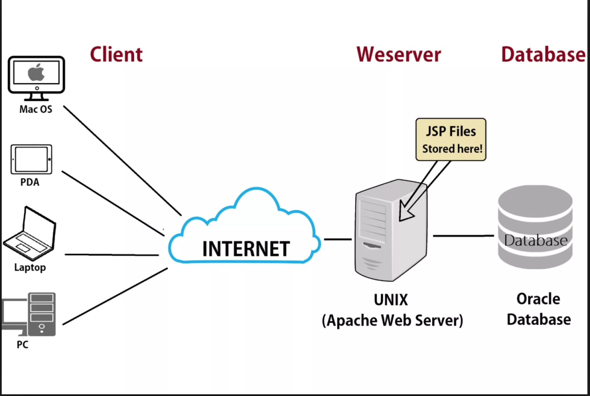

## 2. What are some different web server applications? Include definitions, project’s website/where to download it, which operating system is available for and its latest version.
 
Here are the most prominent web server applications available in 2026:
### Apache HTTP Server 
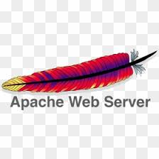
The "Industry Standard." Apache is the most flexible web server, known for its modular system that allows you to turn features on or off as needed.
* **Website:** [Apache](https://www.apache.org/)
* **Best for:** Shared hosting environments and complex configurations where flexibility is key.
* **Operating Systems:** Linux, Windows, macOS, Unix.
* **Latest Version:** 2.4.66 (as of early 2026).
* **Download:** [apache](https://httpd.apache.org/download.cgi)

### Nginx (Engine-X)

The "Performance Powerhouse." Nginx was designed to solve the "C10k problem" (handling 10,000 concurrent connections). It is often used as a Reverse Proxy or Load Balancer in front of other servers.

* **Best for:** High-traffic websites, streaming services, and serving static content quickly.
* **Operating Systems:** Linux, Windows, macOS, Unix.
* **Latest Version:** 1.28.2 (Stable) / 1.29.5 (Mainline).
* **Download:** [nginx](https://nginx.org/) 

### Caddy
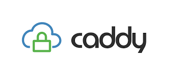

The ***"Modern Choice."*** Caddy is written in Go and is famous for being the first web server to offer automatic HTTPS by default using Let's Encrypt. It is incredibly easy to configure with a single "Caddyfile."

* **Best for:** Developers who want a "set it and forget it" setup with modern security defaults.
* **Operating Systems:** Linux, Windows, macOS, Android, BSD.
* **Latest Version:** 2.11.2 (as of March 2026).
* **Download:** [caddy](https://caddyserver.com/download) 

### Microsoft IIS (Internet Information Services)
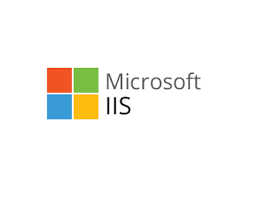
The "Enterprise Option." IIS is deeply integrated with the Windows ecosystem. It is the go-to choice for hosting ASP.NET applications and integrates seamlessly with Active Directory.
* **Best for:** Corporate environments running Windows Server and .NET applications.
* **Operating Systems:** Windows only.
* **Latest Version:** 10.0 (Updated continuously via Windows Server updates).
* **Download:** Included as a "Feature" in Windows; manage via iis.net.[Microsoft IIS](https://www.iis.net/)

### LiteSpeed Web Server
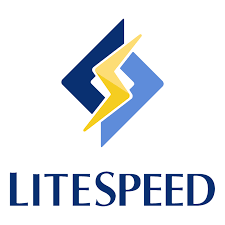

The "Speed King." LiteSpeed is a proprietary (paid) server that is a drop-in replacement for Apache. It reads Apache’s configuration files but performs significantly faster, especially for WordPress sites.
* **Best for:** High-performance web hosting and WordPress optimization.
* **Operating Systems:** Linux, CloudLinux, FreeBSD.
* **Latest Version:** 6.3.4 (as of early 2026).
* **Download:** [LiteSpeed](https://www.litespeedtech.com/products/litespeed-web-server/download) 

### comparison Summary
| server    | primary strength    | License     | Best for                                                                   |
| --------- | ------------------- | ----------- | -------------------------------------------------------------------------- |
| Apache    | Flexibility         | Open-Source | Custom configuration                                                       |
| Nginx     | High concurrency    | Open-Source | Reverse proxy and high traffic                                             |
| IIS       | Windows Integration | Proprietary | [ASP.NET](https://dotnet.microsoft.com/en-us/apps/aspnet) & Corporative IT |
| LiteSpeed | Performance/CMS     | Commercial  | WordPress hosting                                                          |
| Caddy     | Easy to Use         | Open source | Quick setup/Auto                                                           |

## 3. What is virtualization?
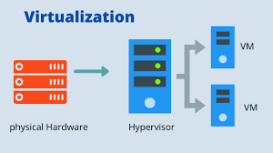
* **Virtualization** is define as creating virtual version of something.
* Virtualization is often used to **let multiple OSs run on one physical machine** at the same time.
* Virtualization allows administrator to **divide the hardware** and create multiple computer **inside a single physical computer**
* **Virtualization is a old concept** however it has gained popularity due the availability of **faster,better and cheaper** hardware.
* Virtualization is one of corner stop technologies of **Cloud computing**
  
 ### Befefits of virtualization
* * Allows running multiple OSs on one machine without dual booting.
* * Allows application to be tested before installing them on a host machine.
* * Reduces cost by decreasing the physical hardware that must be purchased for a network.
*  * Offer the ability to save the state of machine at the giving time and roll it back or forward.
*  * It Allows programs coded for one type of hardware or operating system to work on another that it's not designed to work on .
*  * Can be used to keep legacy applications sandboxed and running past their end of life.

## 4. What is virtualbox?
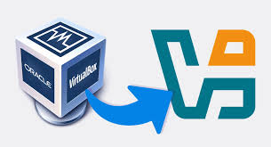 
* VirtualBox is a powerful x86 and **AMD64/intel64** virtualization product for enterprise as well as home use. Not only is a VirtualBox an extremely feature rich, high performance product for enterprise customers,it is also the only professional solution that is freely available as **Open Source Software** under the terms of the of the GNU General Public License (GPL) version 3. 

## 5. What is a virtual machine?
* A virtual machine (VM) is a software-based emulation of a physical computer. It runs an operating system (OS) and applications just like a real computer, but instead of running directly on hardware, it runs on top of a hypervisor or virtualization layer.

## 6.  In the context of virtualization, what does host machine and guest machine mean?

* **The host machine** is the physical hardware. It is the actual computer, server, or laptop that you can touch. It provides the raw resources—like CPU power, RAM, and disk space—that make virtualization possible.
*  * **Role:** It acts as the provider.
* * **Operating System:** The OS running directly on the hardware is called the Host OS (e.g., Windows 11 on your laptop or Linux on a data center server).
* * **Key Component:** The host runs a specialized piece of software called a Hypervisor, which manages and distributes the hardware resources to the guests.
* **The Guest Machine**. The Guest (often called a Virtual Machine or VM) is a completely independent, software-based version of a computer. It "lives" inside the host but acts as if it is its own physical machine.

* * **Role:** It acts as the consumer.
* * **Operating System:** Each guest has its own Guest OS. For example, you could be on a Mac (Host) but running a guest machine with Windows 10 or Ubuntu Linux.
* * **Isolation:** The guest machine doesn't "know" it's virtual. It thinks it has its own dedicated hard drive and memory, even though it’s actually sharing those resources with the host and other guests.

## 7.  What is Debian?
Debian is a free, open-source Linux distribution developed by a volunteer community and known for its high stability, security, and versatility. As one of the oldest and most respected operating systems, it serves as the foundation for many other distributions, including Ubuntu and Linux Mint.

Key aspects of Debian include:

* * **Stability and Reliability:** It is famously stable, making it ideal for servers and workstations where dependability is critical.
* * **The "Universal" OS:** It supports a wide range of hardware architectures, including Intel/AMD (x86/x64), ARM, and PowerPC.
* * **Package Management:** Uses the {Link: APT (Advanced Package Tool) https://en.wikipedia.org/wiki/APT_(Debian)} system, offering access to over 60,000 precompiled software packages.
* * **Free Software Commitment:** Adheres strictly to the Debian Free Software Guidelines (DFSG), ensuring the core system is free and open-source.
* * **Release Structure:** Offers three main branches: **Stable** (rock-solid), **Testing** (pre-stable), and **Unstable** (cutting-edge).
  
## 8. What is a firewall?
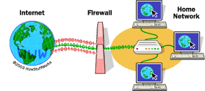
A firewall is a network security system that acts as a barrier between a trusted internal network and untrusted external networks (like the internet). It monitors and filters incoming and outgoing traffic based on predefined security rules to block malicious, unauthorized, or unwanted data. 

## 9. What is SSH?

**Secure Shell (SSH)** is a cryptographic network protocol that provides a secure, encrypted way to operate network services, such as remote login and file transfers, over an unsecured network like the internet. It was designed to replace older, insecure protocols like Telnet and FTP, which transmit data in plaintext. 
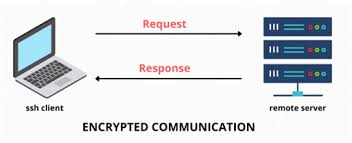

**Key Features and Functionality**

* **Encryption:** All data exchanged between the SSH client (your computer) and the SSH server (the remote machine) is encrypted to prevent eavesdropping or interception.
* **Authentication:** SSH uses strong authentication methods to verify the identity of both the user and the server. The most common method is public-key cryptography, using a public/private key pair, which is more secure than traditional passwords.
* **Data Integrity:** The protocol ensures that data has not been altered during transmission using hashing algorithms.
* **Client-Server Model**: SSH operates on a client-server architecture, where the client initiates a connection to a server that is listening for requests, **`typically on TCP port 22`**.
* **Tunneling/Port Forwarding:** SSH can create secure tunnels to forward other network traffic securely through the encrypted SSH connection, which is useful for accessing services behind firewalls or securing unencrypted applications. 

**Common Uses**

* * **Remote Server Management:** System administrators use SSH to securely log into and manage servers, routers, and other network infrastructure from a remote location.
* * **Secure File Transfers:** SSH includes related protocols like Secure Copy (SCP) and SSH File Transfer Protocol (SFTP) for safely moving files between computers.
* * **Automated Processes:** SSH keys are widely used in scripts and backup systems to enable secure, passwordless machine-to-machine communication and automation.
* * **Executing Remote Commands:** Users can execute specific commands on a remote machine and receive the output securely on their local terminal. 

## 10. What is an IP Address?
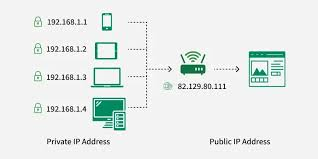
An IP address (Internet Protocol address) is a unique numerical label assigned to every device connected to a computer network. It functions like a digital mailing address, allowing devices to identify and communicate with each other over the internet or a local network.

**Key Functions**
* * **Identification:** It identifies a specific device on a network.
* * **Location Addressing:** It provides the **"location"** of the device in the network, enabling data to be routed to the correct destination.
  
**Main Types of IP Addresses**

* * **Public vs. Private:**
* * **Public:** Assigned by your Internet Service Provider (ISP) and visible to the global internet.
* * **Private:** Assigned by a local router to devices within your home or office network (e.g., your laptop, smartphone, or smart TV).
* * **Dynamic vs. Static:**
* * **Dynamic:** Changes periodically; most home connections use these.
* * **Static:** Remains the same permanently; typically used for servers or businesses that need a consistent address. 

## 11. What is a network mask?
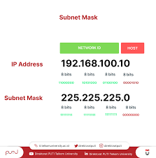
A network mask (or subnet mask) is used in IP networking to define the range of IP addresses that are part of a specific subnet. It helps devices (like routers and computers) understand which portion of an IP address refers to the network and which part refers to the host.
A subnet mask is a **`32-bit number`** used in IP networking to divide an IP address into two parts: **the network portion and the host portion**. It helps devices identify which part of the IP address refers to the network and which part refers to the specific device (host) within that network.

In simpler terms, the subnet mask tells a device whether another IP address is part of the same local network or if it is outside the local network and requires routing.

## 12. What is a port? (in the context of networking/computers)
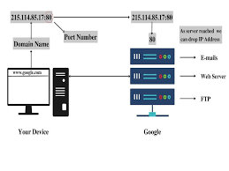

A port is a number used to identify a specific service or application on a device that is connected to a network. It helps the computer know which program should receive the data that arrives.

**Common Port Numbers**
 
| **Port** | **Service**               |
| -------- | ------------------------- |
| 20/21    | FTP (file transfer)       |
| 22       | SSH (secure remote login) |
| 25       | SMTP (email sending)      |
| 53       | DNS (domain name system)  |
| 80       | HTTP (websites)           |
| 443      | HTTPS (secure websites)   |

## 13. What is port forwarding?
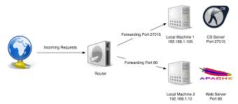

Port forwarding (or mapping) is a router configuration that directs external internet traffic to a specific device or service within a private local network. It maps a public IP address and port to an internal IP, commonly used for hosting game servers, accessing security cameras, or remote desktop connections

**Key Details About Port Forwarding:**

**How it Works:** It operates as an application of Network Address Translation (NAT). The router acts as a receptionist, receiving external requests and forwarding them to the correct internal device.
**Common Use Cases:**
* * **Gaming:** Hosting game servers (e.g., Minecraft).
* * **Remote Access:** Accessing home computers via RDP or SSH.
* * **Media/File Sharing:** Accessing NAS devices or Plex media servers.
* * **Security:** Viewing CCTV or IP cameras remotely.
 
**Security Risks:** Opening ports can expose your network to threats. It is important to only open necessary ports, use firewalls, or consider alternatives like VPNs (Virtual Private Network).
**Configuration:** Rules are set in the router settings, defining the external port, internal IP address, and internal port. 

## 14. What is localhost? (in the context of networking/computers)

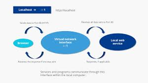
"Localhost" is A hostname representing your own computer, used to test network services locally without accessing the internet. It acts as a loopback interface, mapping to the IP address 127.0.0.1 (IPv4) or ::1 (IPv6). Developers use it to run web servers, databases, and applications in a secure, private, and fast environment. 

**Key Aspects of Localhost:**

* **Function:** It tells the operating system to direct network requests back to the machine that initiated them, skipping external network connections.
* **Purpose:** Primarily used for web development, software testing, and debugging to ensure code works before deployment.
* **Loopback Address:** While localhost is the name, it is mapped to the reserved IP address 127.0.0.1.
* **Security:** Traffic on localhost never leaves the machine, making it inherently secure.

## 15. What does this ip address represent 127.0.0.1?

127.0.0.1 is the default IPv4 loopback address, commonly known as localhost. It allows your computer to communicate with itself, serving as a "home" address for testing software, web servers, and network configurations without sending traffic to an external network or the internet. 
**Key details about 127.0.0.1:**

* **Purpose:** It allows for testing web applications or services on a local machine before they go live.
* **Loopback Functionality:** Any data sent to this address is immediately routed back to the same device, bypassing the network interface card (NIC).
* **Terminology:** While 127.0.0.1 is the IP address, "localhost" is the hostname that typically maps to it.
* **Range:** It is part of a reserved range (127.0.0.0 to 127.255.255.255), all of which point back to the local device. 

It is the standard, local-only equivalent to an internet-facing IP address. 

## 16. What is Git?

**Git** is a version control system that tracks changes in computer files. It is the industry standard for developers to collaborate on projects, ensuring that no work is lost and that multiple people can work on the same code simultaneously without overwriting each other.

Think of it as a "time machine" for your project. If you make a mistake, you can simply roll back the files to exactly how they were an hour, a day, or a year ago.
**How Git Works**

**Git is a distributed system**. This means every person working on a project has a full copy of the entire history of the code on their own computer. This makes it incredibly fast and reliable.

**Key Concepts**

* * **Repository (Repo):** A folder that Git is tracking. It contains all your project files and the history of every change made to them.

* * **Commit:** Think of this as a "save point." When you commit your changes, you are telling Git to take a snapshot of your files at that exact moment.
* * **Branch:** A way to diverge from the main line of work. You can create a branch to experiment with a new feature without affecting the stable "main" version of your project.
* * **Merge:** The process of taking the changes from one branch and putting them into another (e.g., adding your new feature back into the main project).

## 17. What is GitHub?

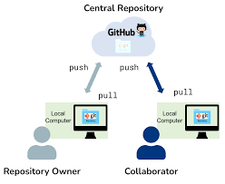
GitHub is a cloud-based platform that allows developers to store, manage, and collaborate on code projects using Git version control. It acts as a central hub for hosting software repositories, enabling team collaboration through features like code reviews, bug tracking, and pull requests. Owned by Microsoft, it is widely used for both open-source and private development. 
Key Aspects of GitHub:

**Git Repository Hosting:** GitHub hosts Git repositories in the cloud, allowing developers to back up code and work from any location.
**Collaboration Tools:** Features like pull requests, branches, and code reviews enable multiple developers to work on the same project simultaneously without overwriting each other's work.
**Version Control:** It tracks changes to code over time, allowing users to revert to previous versions if necessary.
**Social Coding:** Users can follow, fork, and contribute to other people's open-source projects.
**Project Management:** Includes tools for task management, bug tracking, and documentation (wikis) for projects. 

**Difference Between Git and GitHub:**

**Git** is the actual software tool used for version control, running locally on a developer's computer.
**GitHub** is the web-based, external service that hosts those Git repositories, adding a user interface and collaboration features. 

GitHub is used by individuals, teams, and large organizations to build, share, and maintain software projects. 

 **Git vs. GitHub difference**

| **Feature**   | **Git**                                             | **GitHub**                                         |
| ------------- | --------------------------------------------------- | -------------------------------------------------- |
| What is it?   | The actual software/tool that tracks your files     | A cloud-based hosting service for Git repositories |
| Where is it?  | Runs locally on your computer (via terminal or app) | Runs on a website (remote server)                  |
| Core Function | Version control and history                         | Collaboration, sharing, and project management.    |