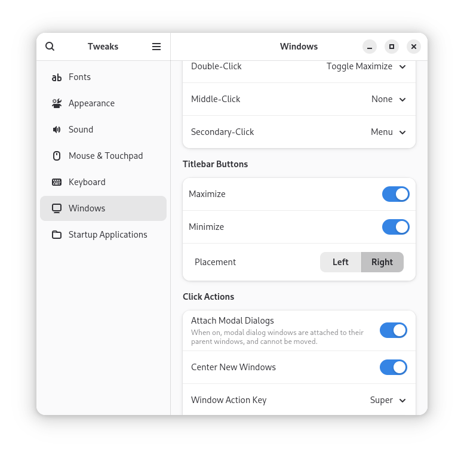
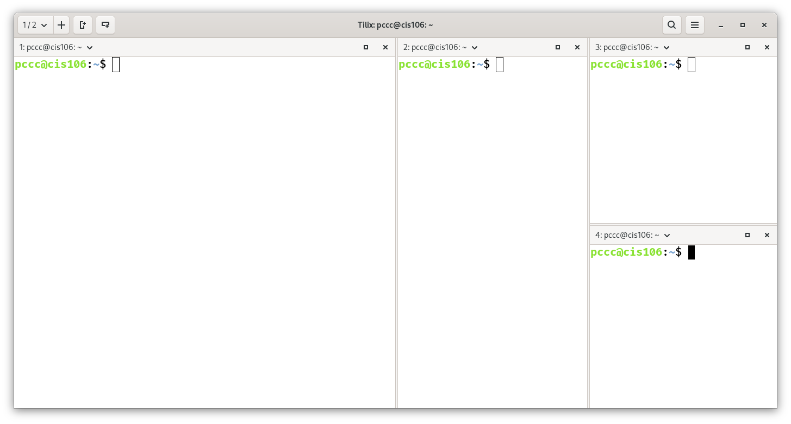
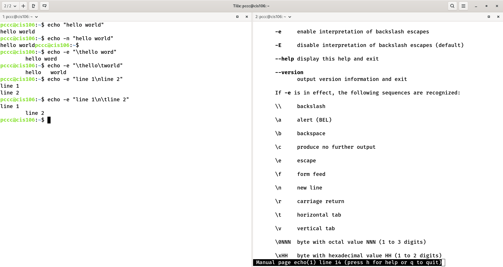
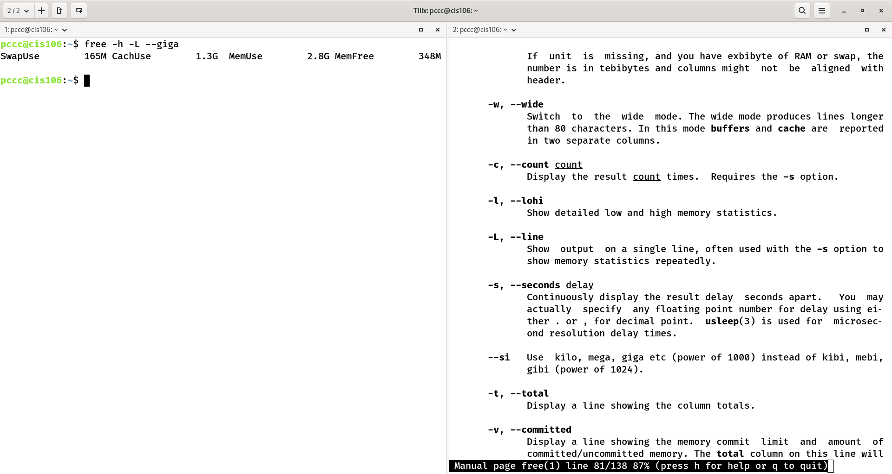
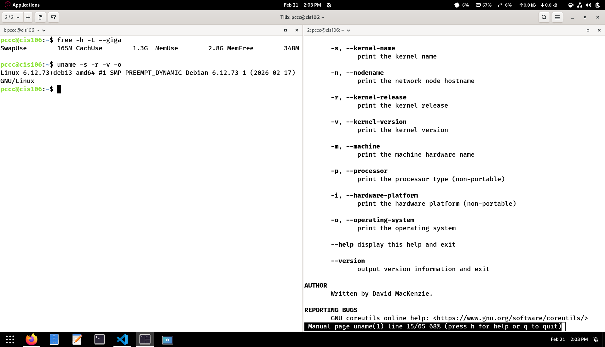
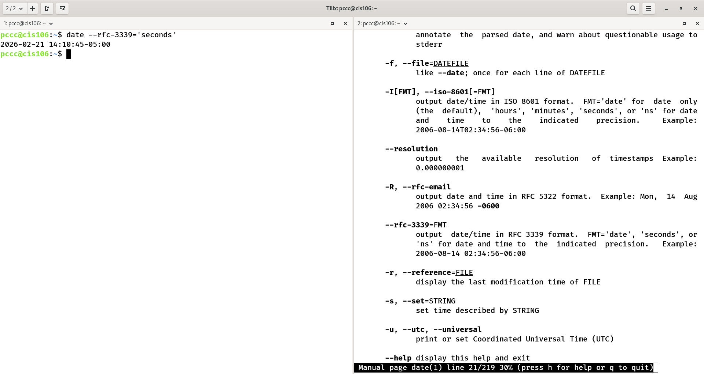

# Lab 3 Submission

## Question 1

## Question 2

## Question 3

## Challenge Question
<<<<<<< HEAD

## Challenge Question Script Source code:
[lab3](lab3-script.sh)
=======

>>>>>>> b6be098 (notes 3 completed)
