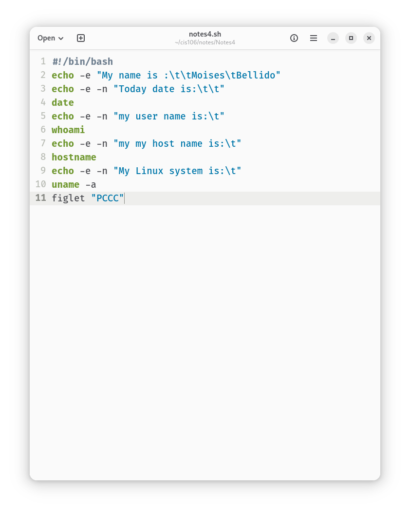
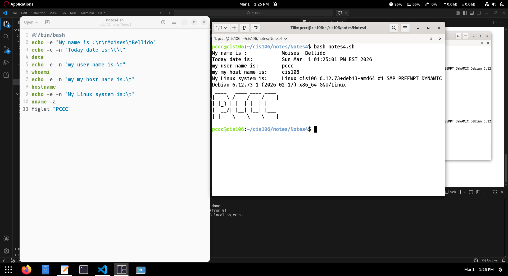

# How to install and remove software using the APT command
*  formula **`sudo` + `apt` + `install` + `package name`**
* The **install** option install the specific package
* The **remove** option removes the specific option
* You can **install/remove** multiple programs by adding the package name with a space between each package.
* You can also **remove** package by adding an `-` sign at the end of the package name.package.
* You can **add and remove** packages at the same time by using a `+` 
* and `-` at the end of each package.
 
*  ## Here are some useful examples 
*  * Install several programs in a single command 
*  * **`sudo apt install firefox flameshot caffeine -y`**
*  * Remove several programs in a single command
*  * **`sudo apt remove firefox flameshot caffeine -y`**
*  * Install and remove programs in a single command 
*  * **`sudo apt install firefox+ flameshot- caffeine- vlc+`**
*  * Remove programs and all remaining traces
*  * **`sudo apt purge firefox+ flameshot- caffeine- vlc+`**
*    
# How to create a shell script step by step including screenshots and how to run it. Try to be as detailed as possible.
1. ## Open the text editor
 * On debian 13  go to application menu like GNOME and click on text editor 
2. ## Create a new script file
  * Create a folder in file manger home where the Bash will be save .for example home/cis106/notes/Notes4/notes4.sh
  * Open Gnome text editor from you application menu
  * Every shell script start with a Shebang `#!/bin/bash`
  * Type #!/bin/bash and save in the folder scripts and give a name for example notes4.sh 
  * 
  3. ## Write the code
  * The first line is the shebang it tells the computer to use the Bash interpreter to run this file.
  * Add some commands to the  script.
  * #!/bin/bash
  * Echo -e " My name is:\t\tMoises\tBellido"
  * Echo -e -n " today date is:\t\t"
  * date
  * echo -e -n "My user name is:\t"
  * whoami
  * echo -e -u "My hostname is:\t"
  * hostname
  * echo -e -n " My linux system is:\t"
  * uname -a
  * figlet 'PCCC"
  4. ## Running the script
  * save the script
  * Open the a terminal(or go to home/cis106/notes/Notes4/) and right click in open tilix here.
  * Run the bash : type the name of the Bash `bash notes4.sh`  and enter.
  * 