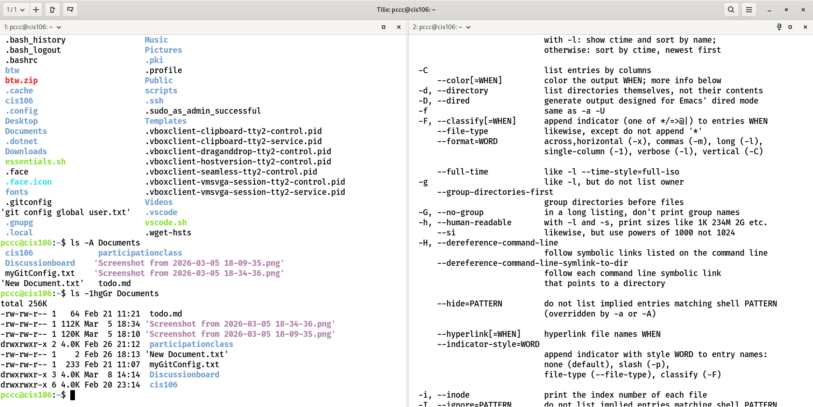
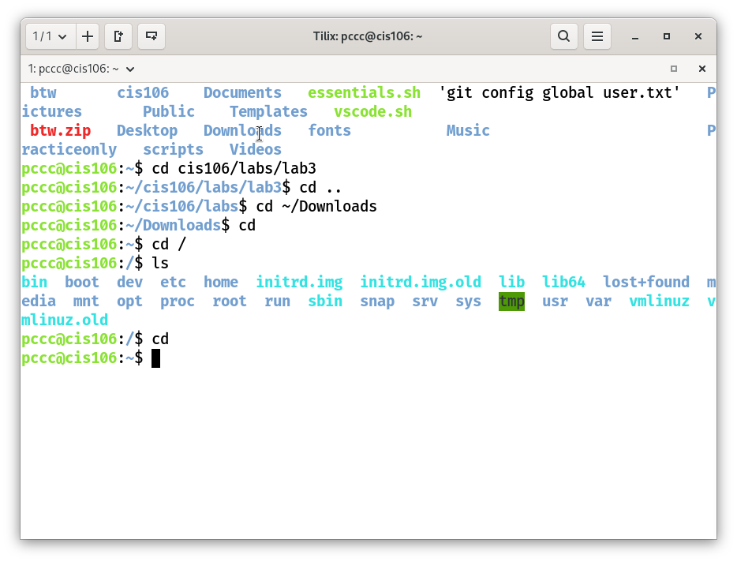
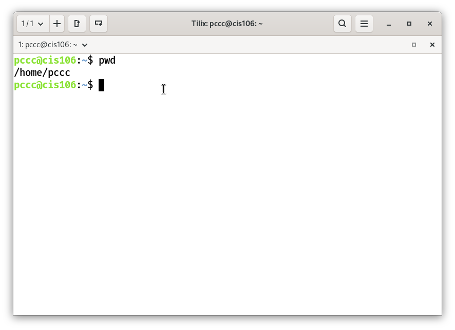
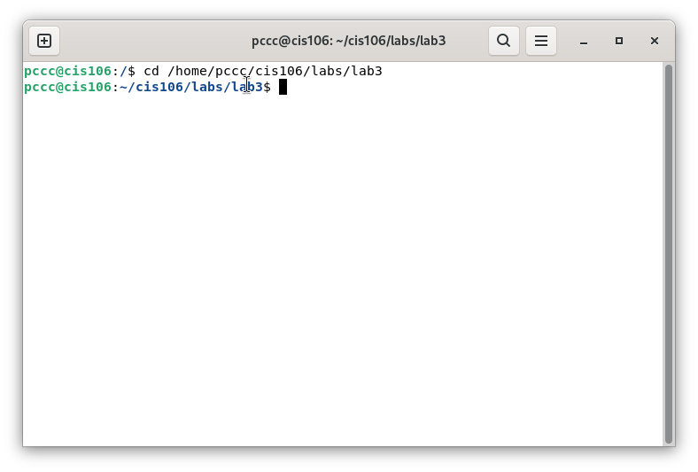
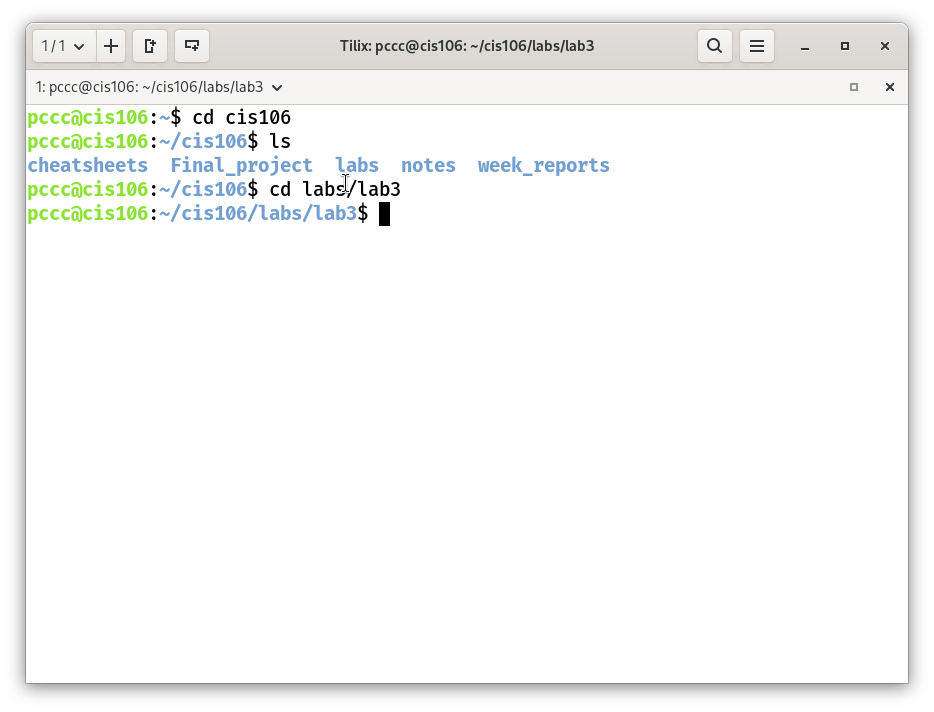

## Commands for navigating the file system 

## LS

* ### Usage
  * Is is used for listing files and directories. 
  * By default it will list the current directory when no directory is  specified. 
  * Listing means to see what is inside a directory.

* ### Formula
  * `ls` + `option` + `directory to list`

* ### Samples

  * See all the options of the ls command (extracted from the man page):
    * `ls --help`
 
  * list the current directory:
    * `ls`
  * List all the files including hidden files in current directory:
    * `ls -A`
  * List all the files inside a given directory:
    * `ls -A /usr/share/fonts/X11` (absolute path)
    * `ls -A Documents/` (relative path assuming that the $PWD is $HOME)
  * Long list a directory
    * `ls -lA ~/Pictures`
  * List a directory recursively
    * `ls -R Documents/`
  * Long list a directory only
    * `ls -ld Documents/`
  * List a directory sorted by last modified
    * `ls -t Documents/`
  * List a directory sorted by file size
    * `ls -S Documents/`
  * Long list a directory excluding group and owner information, with human readable file size and sorted in reverse order.
    * `ls -lhgGr Documents/`

## CD

* ### Usage

  * Changes the current working directory.
  * In other words, it moves you from one directory to another. 
  * By default, it will always send you to your home directory.
   
* ### Formula
    * `cd + destination absolute path or relative path`
     
* ### Examples
    * Go (change your current directory) to your home directory (there is more than 1 way of doing this):
    `cd` (without any arguments, cd will take you **home**)
    `cd ~` (using the ~ special character. as ~ will expand to the absolute path of the user’s home directory)
    `cd $HOME` (using the $HOME environment variable)
    `cd /home/$USER/Downloads` (using $USER environment variable in the path)

    * Go to a specified directory with **absolute path:**
    `cd /usr/share/themes`

    * Go to a specified directory with **relative path** assuming your current working directory is /home
    `cd maria53/Downloads/`

    * Go to the previous working directory. This is useful when you are working with 2 directories located far in the directory tree
    `cd -`

    * Go to the previous directory in the directory tree. One directory above.
    `cd ../`

    Go to 2 directories above the directory tree
    `cd ../../`

    

## PWD

* ### Usage

   * Displays the absolute path of the current working directory.

* ### formula
  * `pwd`
* ### Examples
  Print the absolute path of current working directory

   * `pwd`

## What is a variable?
 * In programming, a variable is place to store data. A variable is like a box with a label
in programming a variable can be used to store temporary or permanent information that you will continuously reuse in your program.

## How do I use a variable?
* To create a variable, use the equals sign `(=)` without any spaces around it. Variable names typically start with a letter or an underscore and can contain letters, numbers, and underscores. 
**Syntax:** `VARIABLE_NAME=value`
 * For sample `username="Frank"`
The variable name now stores the value `frank`. When evener the programs need to access the frank's `username`, it can do it by referencing the variable username.

## What is an environment variable?

  * Environment variables store values of a user’s environment and can be used in commands in the shell. These values can be unique to the user’s environment which makes them ideal when writhing commands that you want to use regales of which user is using the computer. To see a list of your environment variables type `env`. To use the value stored in an environment variable you must prepend the variable name with a $. Here are some useful environment variables:
  * **$USER** = stores the current’s user username
  * **$HOME** = stores the absolute path of current’s user home directory
  * **$PWD** = stores the absolute path of the present working directory.
  * **$OLDPWD** = stores the absolute path of the previous current working directory

## What is a user defined variable?
A user-defined variable is a custom variable created by the user to store data such as text, numbers, or command results in the Linux shell.

## What is the root directory?
* The root directory: The first directory in the filesystem that contains the entire filesystem represented by `“/”`.

## What does “Parent Directory” mean?
* A directory containing one or more directories and files.

## What does “Current working directory” mean?
* Also known as the present working directory. It is the directory where you are currently working in. You are always working from a directory.

## What is an absolute path? Include an example
   * Absolute Path: The location of a file starting at the root of the file system.
   * The advantage of absolute paths is that they can be used at any point of the file system regardless of your current directory. 
   * Any command that is given an absolute path will be able to find the file because it will start at the beginning of the filesystem. 
   * The disadvantage is that a command can be long to type if the file path is long.
 
   * **Sample:**
   * `/home/pccc/cis106/labs/lab3/`
   * 
   * 
   * 

## What is a relative path? Include an example
* The location of a file starting from a child directory of the current working directory or from the current directory itself. 
* The advantage of using relative path is that typing commands is faster. 
* The disadvantage of relative paths is that they cannot work from anywhere in the filesystem. 
* In order for a relative path to work, a file must be reachable from the current directory onwards. 
* Another disadvantage of relative paths is that they require a better mental understanding of the linux filesystem in the sense that you must keep a mental image of the directory tree that you are working with.

* **Example*
* `cd labs/lab3` 
* 
 

## What is the difference between “Your home directory” and the home directory”?

* **YOUR HOME DIRECTORY:**
  * This is your user’s personal directory where all your files are located. 
  * Every user has it’s own private home directory .
  * It's where your personal files.configs, ans setting are storage.
  * It is usually locate under `/home`
  
  * **Example**
    `/home/pccc/`

* **The home directory**
  * Refers to the concept or general location of a home directory.
  * Not directed at a specific person.
  * The home directory usually refers to the parent directory that holds all users’ home directories.

  * **Example**
  *  * `/home`
  * 
  * *  Inside `/home`  are directories for each user:
  * * /home/pccc
  * * /home/Mo
  * * /home/Jeff