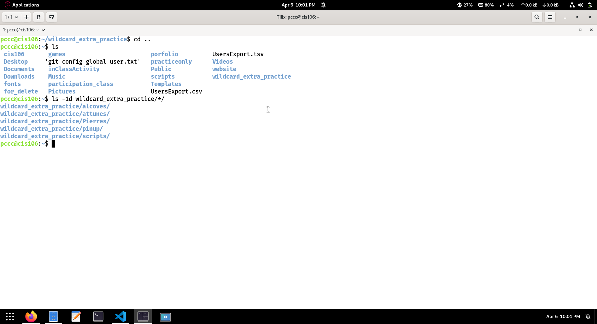
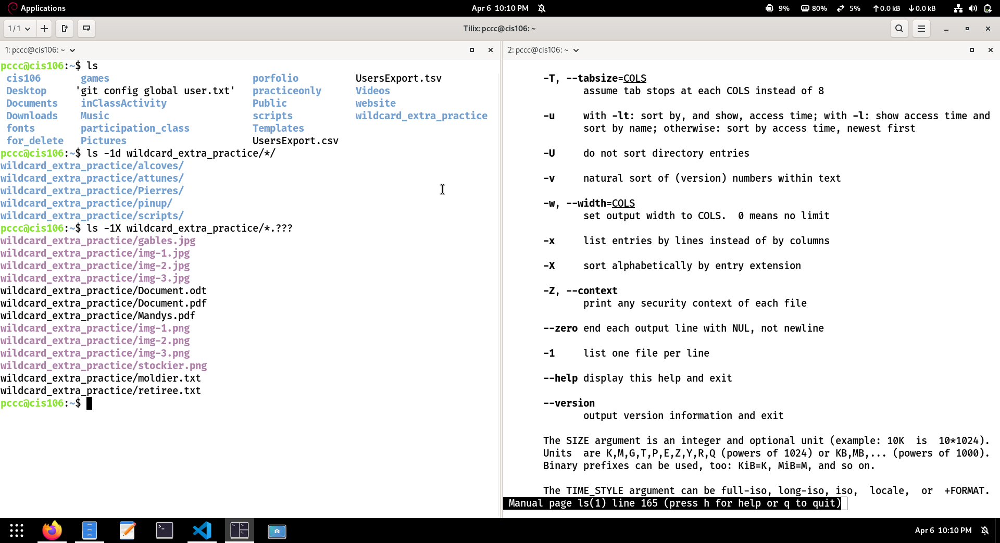
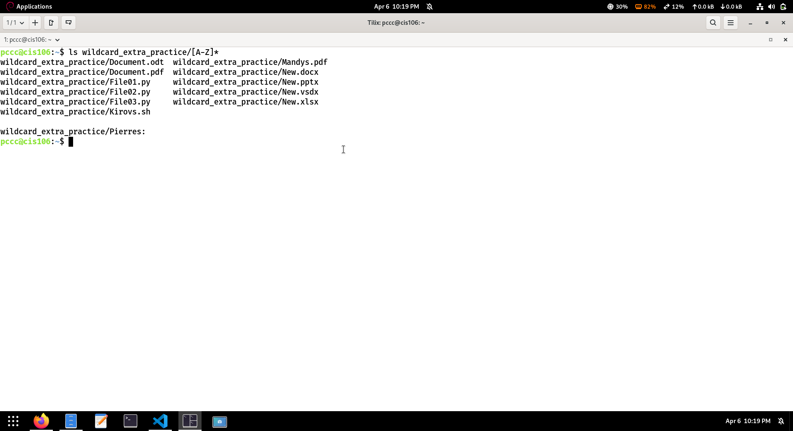
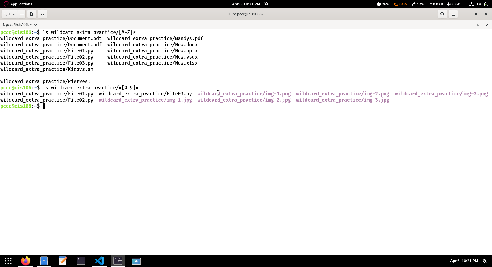
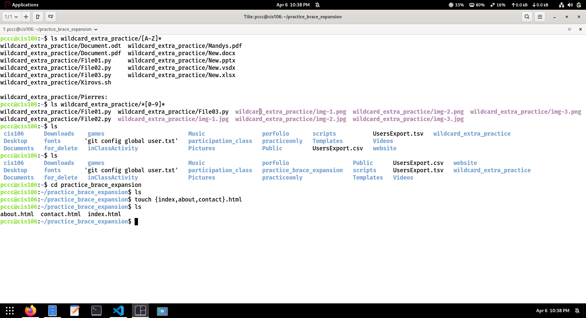
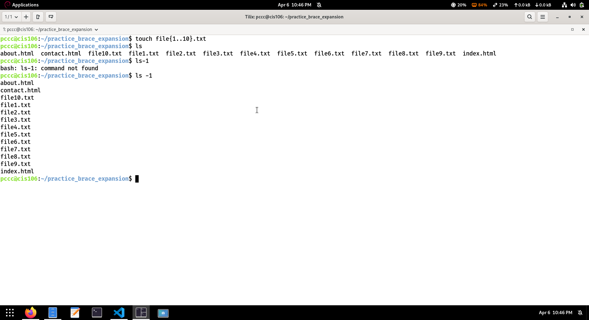
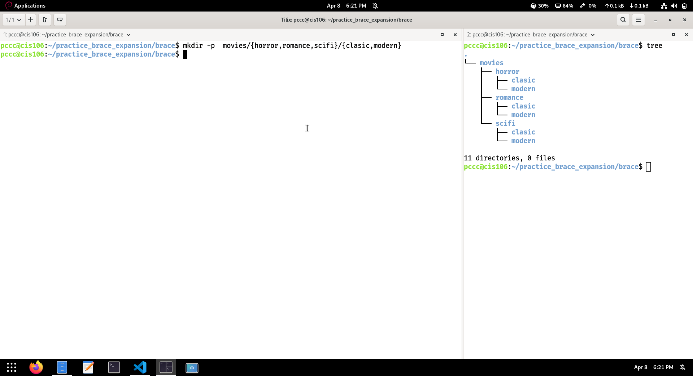
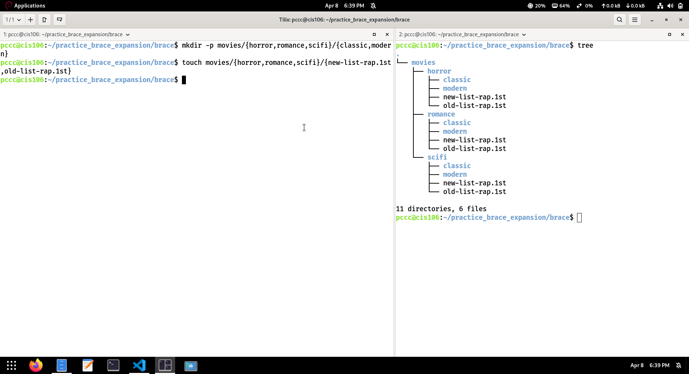

# notes 7 wildcards
## the wildcard
* **Definition**
  * Wildcards or file globing is a shell feature that, using special characters, allows us to rapidly specify groups of filenames. Because we work with files all the time, it is useful to be able to work with multiple files at the same time.
* **commond Wildcards**
  * **`*(Asterisk)`**
  * Maches zero to any number of characters
  * **Example**
    * List all files ending with `.txt`
    * `ls *.txt`
    * List all the files in given directory
    * `ls Downloads/*`
    * 
    * List all of the directories inside a giving directory without listing their content.
    * `ls -1d wildcard_extra_practice/*/`
    * 
    * list all the files in a given directory that start with letter **f**
    * `ls Downloads/f*.txt`
    * List all the files that contain the word file in the name
    * `ls *file*`
    * Deletes files starting with **file**
    * `rm file*`
  * **? (Question mark)**
    * Matches only one character
  * **Example**
    *  `ls file?.txt`
    * matches:
    * file1.txt
    * fileA.txt
     
    * List all hidden files in the current working directory
    * `ls./.??*` 

    * List all the hidden files in the parent directory
    * `ls ../..??*`
     
    * List all the files that have 2 characters in the file name between letters **b** and **K**
    * `ls b??k*` 
    * List all the files  with a 2 letters file extension
    * `ls *.??`
    * list all the files that contain a 3 letters file extension
    * `ls -1X wildcard_extra_practice/*.???`
    * 
 
 
  * **[set] (Square brackets)** 
  * Matches 1 character from as given set
    * **Example**
    * List all the files that start with a capital letter
    *  `ls wildcard_extra_practice/[A-Z]*`
    * 
   
    * List all the files that contain a number in their name
    *  `ls wildcard_extra_practice/*[0-9]*`
    *  
       
  * **Brace Expansion**
    *  Brace expansion is not a wildcard but a feature of the bash shell that allows you to create strings without needing loops. The strings can be filenames, sequences, or patterns. Brace expansion is handled before file globing and variable expansion.
    
    * Brace expansion is used in the following manner:

    * `Open brace { + pattern separated by commas with no spaces + closing brace }.`
  * **Examples**
    * Create 3 html files
    * `touch {index,about,contact}.html`
    * 
    * 
    * Create 10 files numbered 1 to 10
    * `touch file{1..10}.txt`
    * 
   
     
  * **Brace expansion**
    * `mkdir -p movies/{horror,romance,scifi}/{classic,modern}`
        * 
   
    * `mkdir -p movies/{horror,romance,scifi}/{classic,modern}`
    * `touch movies/{horror,romance.scifi}/{new-list-rap.1st,old-list-rap.1st}`
    * 
     
     
   

 
     